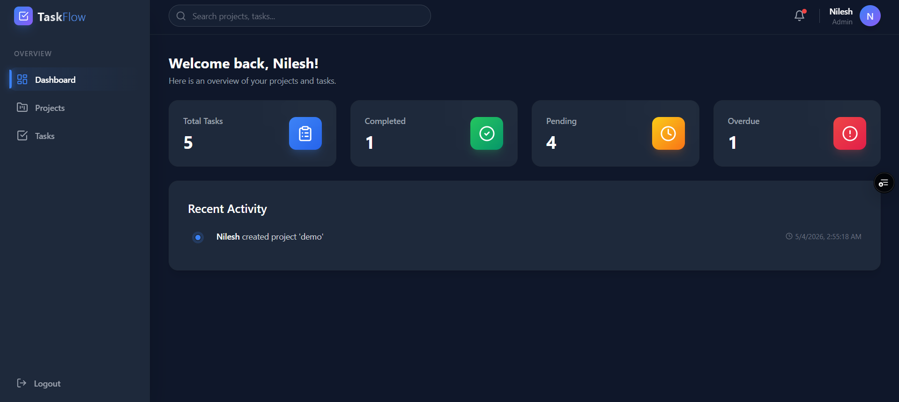
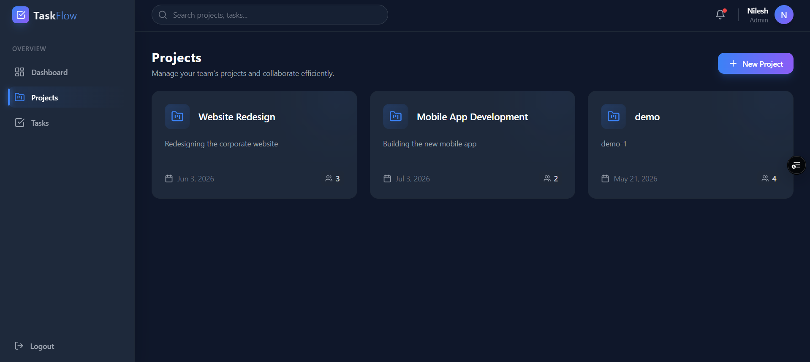
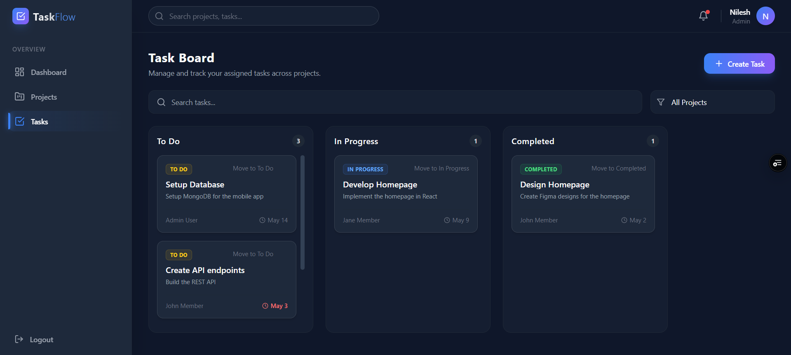

# 🚀 TeamTask – Full Stack Project Management App

A modern full-stack project management application that allows users to create projects, assign tasks, and track progress with **role-based access control (Admin / Member)**.

---

## 🌐 Live Demo

* 🔗 Frontend: https://team-task-manager-6wg9.vercel.app/
* ⚙️ Backend API: https://team-task-manager-production-3918.up.railway.app

---

## 📸 Screenshots

### Dashboard



### Projects



### Tasks



---

## ✨ Features

### 🔐 Authentication

* Secure Signup & Login using JWT
* Password hashing with bcrypt

### 👥 Role-Based Access Control

* **Admin**

  * Create and manage projects
  * Assign tasks to members
  * View all data
* **Member**

  * View assigned tasks
  * Update task status

### 📁 Project Management

* Create and organize projects
* Manage team tasks efficiently

### ✅ Task Management

* Create tasks with:

  * Title & description
  * Assigned user
  * Status (To Do / In Progress / Completed)
  * Deadlines
* Track overdue tasks

### 📊 Dashboard

* Total tasks
* Completed tasks
* Pending tasks
* Overdue tasks

### ⚡ Additional Highlights

* Responsive UI (mobile + desktop)
* Clean and modular architecture
* Fully deployed full-stack application

---

## 🛠 Tech Stack

| Layer      | Technology           |
| ---------- | -------------------- |
| Frontend   | React + Tailwind CSS |
| Backend    | Node.js + Express    |
| Database   | MongoDB Atlas        |
| Deployment | Vercel + Railway     |

---

## 📂 Project Structure

```bash
team-task-manager/
  frontend/   # React frontend
  backend/    # Express backend
```

---

## ⚙️ Run Locally

### Backend

```bash
cd backend
npm install
npm run dev
```

### Frontend

```bash
cd frontend
npm install
npm run dev
```

---

## 🔐 Environment Variables

### Backend (`.env`)

```env
PORT=5000
MONGO_URI=your_mongodb_atlas_url
JWT_SECRET=your_secret_key
JWT_EXPIRE=7d
```

### Frontend (`.env`)

```env
VITE_API_URL=https://team-task-manager-production-3918.up.railway.app
```

---

## 📡 API Overview

| Method | Endpoint              | Description     |
| ------ | --------------------- | --------------- |
| POST   | /api/v1/auth/register | Register user   |
| POST   | /api/v1/auth/login    | Login           |
| GET    | /api/v1/projects      | Get projects    |
| GET    | /api/v1/tasks         | Get tasks       |
| GET    | /api/v1/dashboard     | Dashboard stats |

---

## 🔐 Demo Credentials

| Role   | Email                                           | Password   |
| ------ | ----------------------------------------------- | ---------- |
| Admin  | [admin@example.com](mailto:admin@example.com)   | Admin@123  |
| Member | [member@example.com](mailto:member@example.com) | Member@123 |

---

## 🌟 Highlights

* Role-Based Access Control (RBAC)
* RESTful API design
* Clean UI with modern UX
* Fully deployed full-stack application
* Production-ready environment setup

---

## 🚧 Future Improvements

* Notifications system
* Comments on tasks
* File attachments
* Real-time updates (WebSockets)

---

## 👨‍💻 Author

**Nilesh Dhakad**

* GitHub: https://github.com/nileshdhakad18
* LinkedIn: https://www.linkedin.com/in/nilesh-dhakad/

---

## ⭐ If you found this useful, consider giving it a star!
